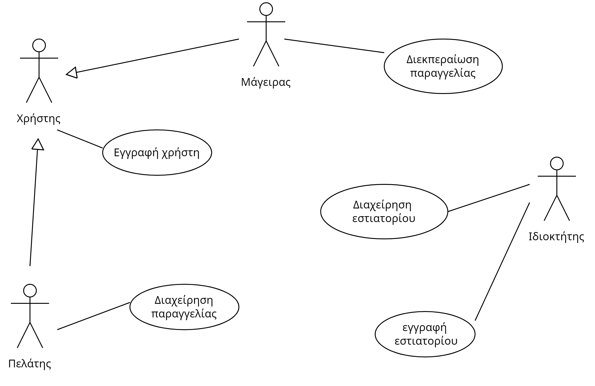
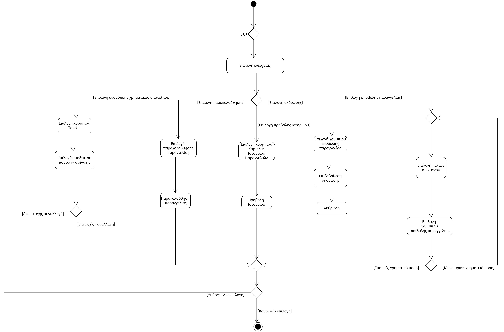
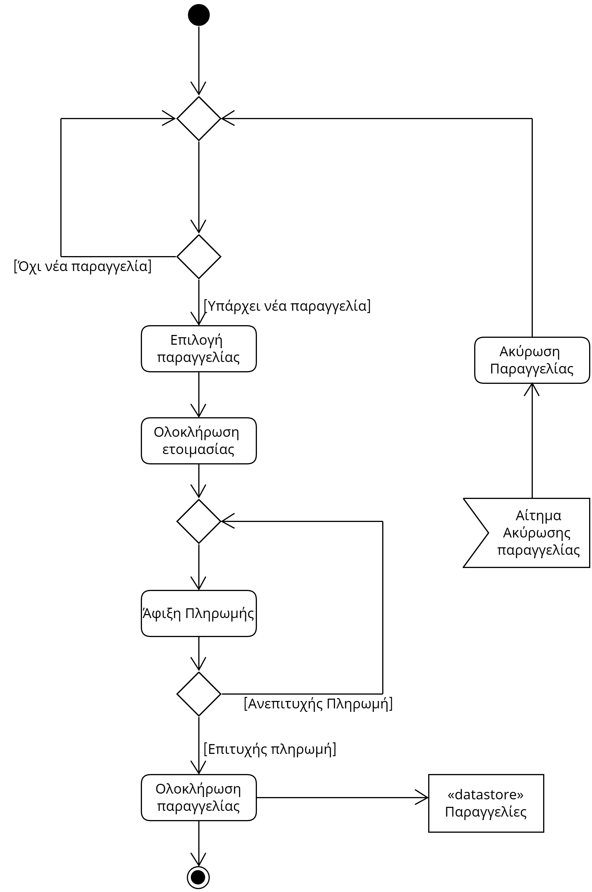
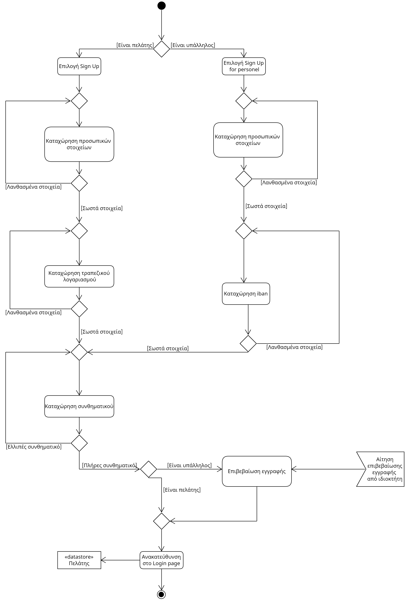
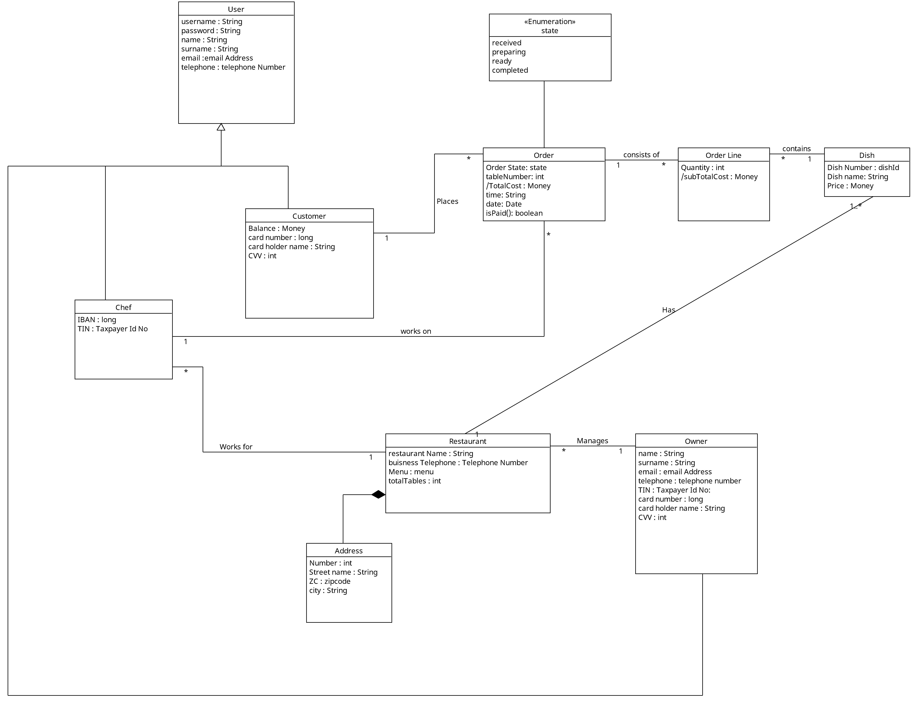
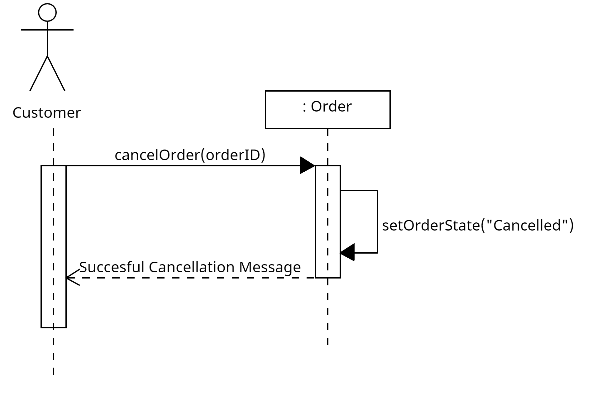
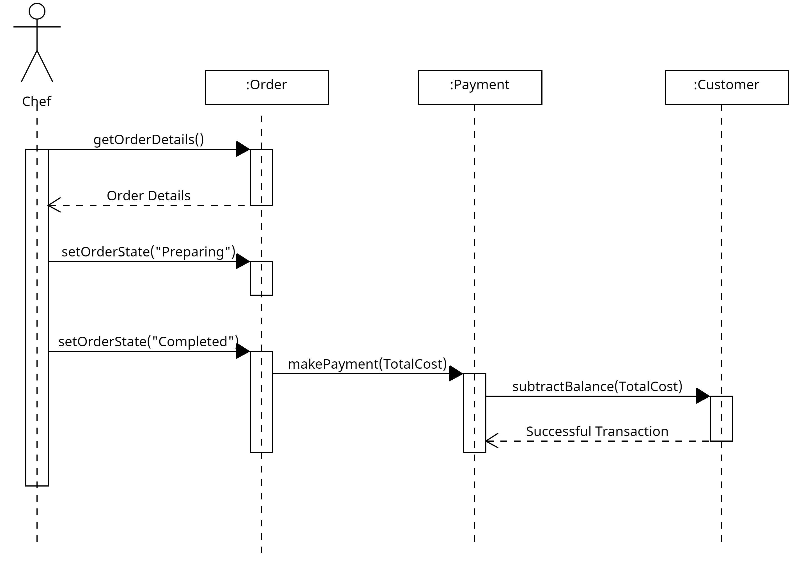
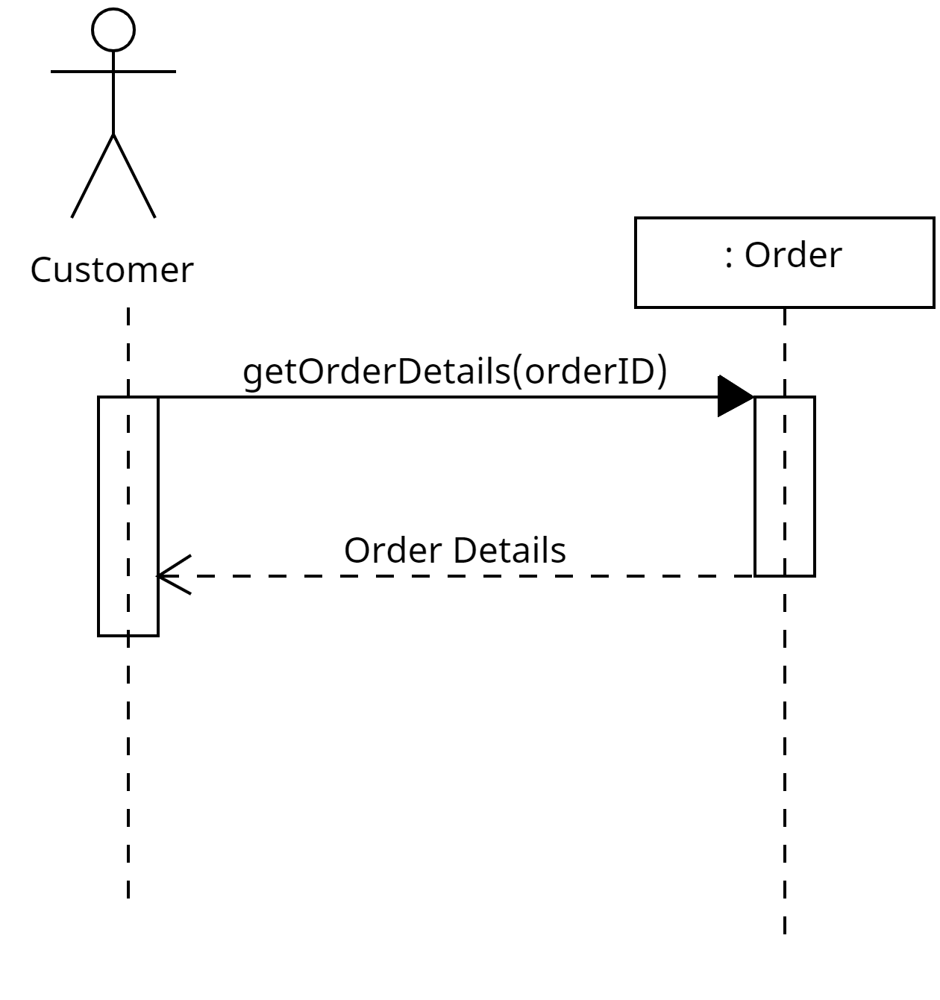
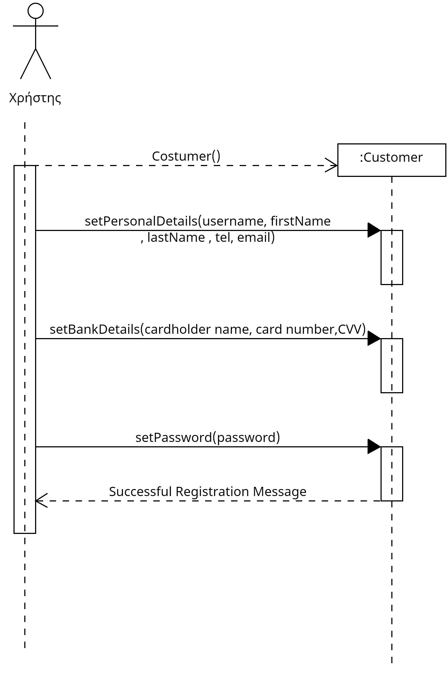

# **R2 Απαιτήσεις λογισμικού / Ανάλυση προβλήματος**

## **2.1** Μοντέλο περιπτώσεων χρήσης

## **2.1.1.**  Διάγραμμα περιπτώσεων χρήσης:

## [Use Case Diagram link](docs/uml/use_case/restaurant_use_case.uxf)

## **2.1.2** Περιγραφή περιπτώσεων χρήσης:

## [Use case descriptions link](docs/markdown/R2_use_cases_descriptions.md)

## **2.1.3** Διαγράμματα δραστηριότητας:

## [Activity Diagram για υποβολή παραγγελίας](docs/uml/Activity_diagrams.uxf/activity-order.uxf)

## [Activity Diagram για διεκπεραίωση παραγγελίας](docs/uml/Activity_diagrams.uxf/activity-making-order.uxf)

## [Activity Diagram για εγγραφή χρήστη](docs/uml/Activity_diagrams.uxf/activity-user-register.uxf)

## **2.2** Συμπληρωματικές προδιαγραφές για τις μη λειτουργικές απαιτήσεις.

## [Μη λειτουργικές απαιτήσεις έγγραφο link](docs/markdown/non-functional-requirements.md)

## **2.3** Ανάλυση απαιτήσεων
## **2.3.1** [Διάγραμμα Μοντελοποίησης πεδίου link](docs/uml/domain_model/domain_modeling_diagram.uxf)

## **2.3.2** 

##   [Sequence diagram ακύρωση παραγγελίας](docs/uml/Sequence_diagrams.uxf/order_cancellation_seq%20_diagram.uxf) 

    

 ##  [Sequence diagram υποβολή παραγγελίας](docs/uml/Sequence_diagrams.uxf/Order_placing_sequence_diagram.uxf)
   
   

 ##  [Sequence diagram ετοιμασία παραγγελίας απο μάγειρα](docs/uml/Sequence_diagrams.uxf/order_processing_sequence_diagram.uxf)

   

 ## [Sequence diagram παρακολούθηση παραγγελίας](docs/uml/Sequence_diagrams.uxf/Order_spectating_seq_diagram.uxf)

  

 ## [Sequence diagram εγγραφή χρήστη](docs/uml/Sequence_diagrams.uxf/Signup_sequence_diagram.uxf)

  