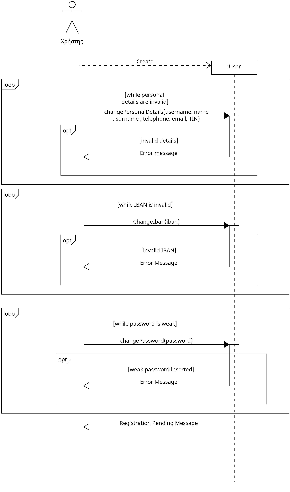
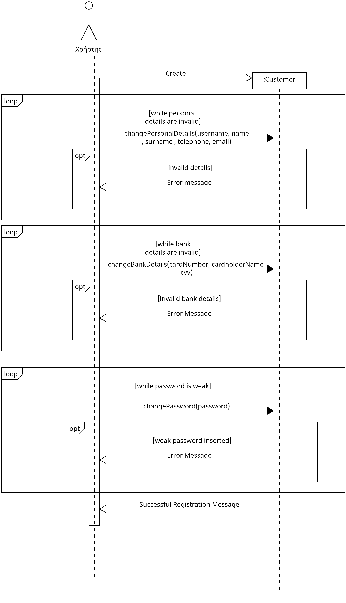
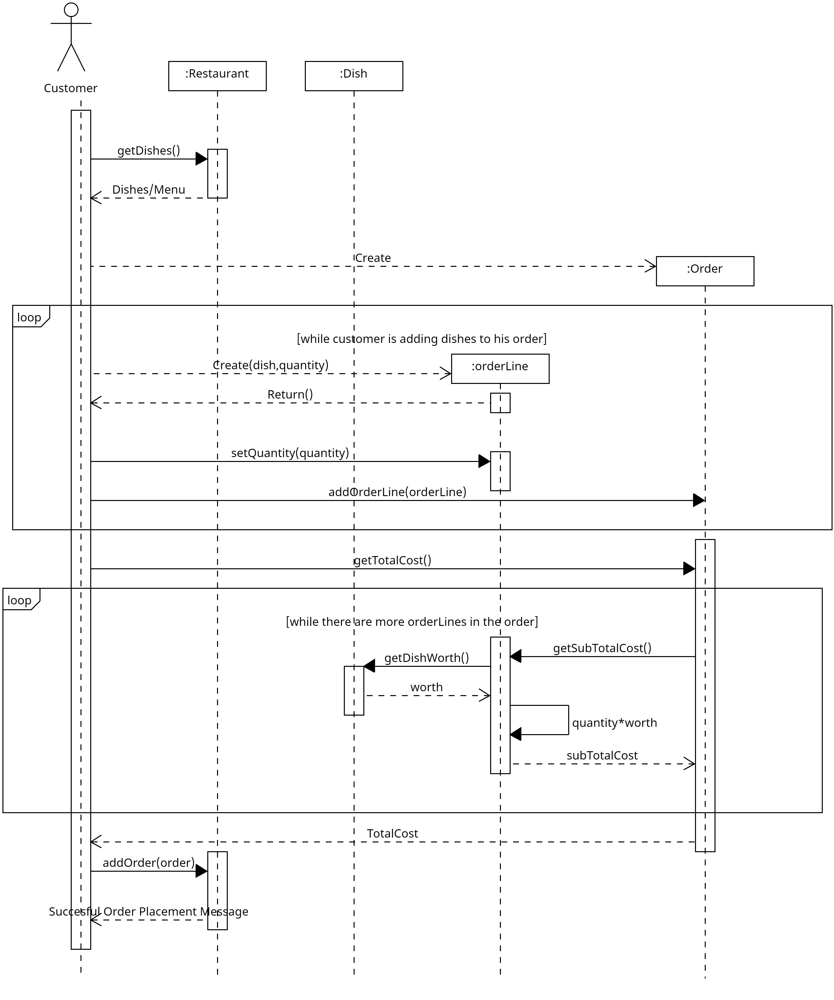
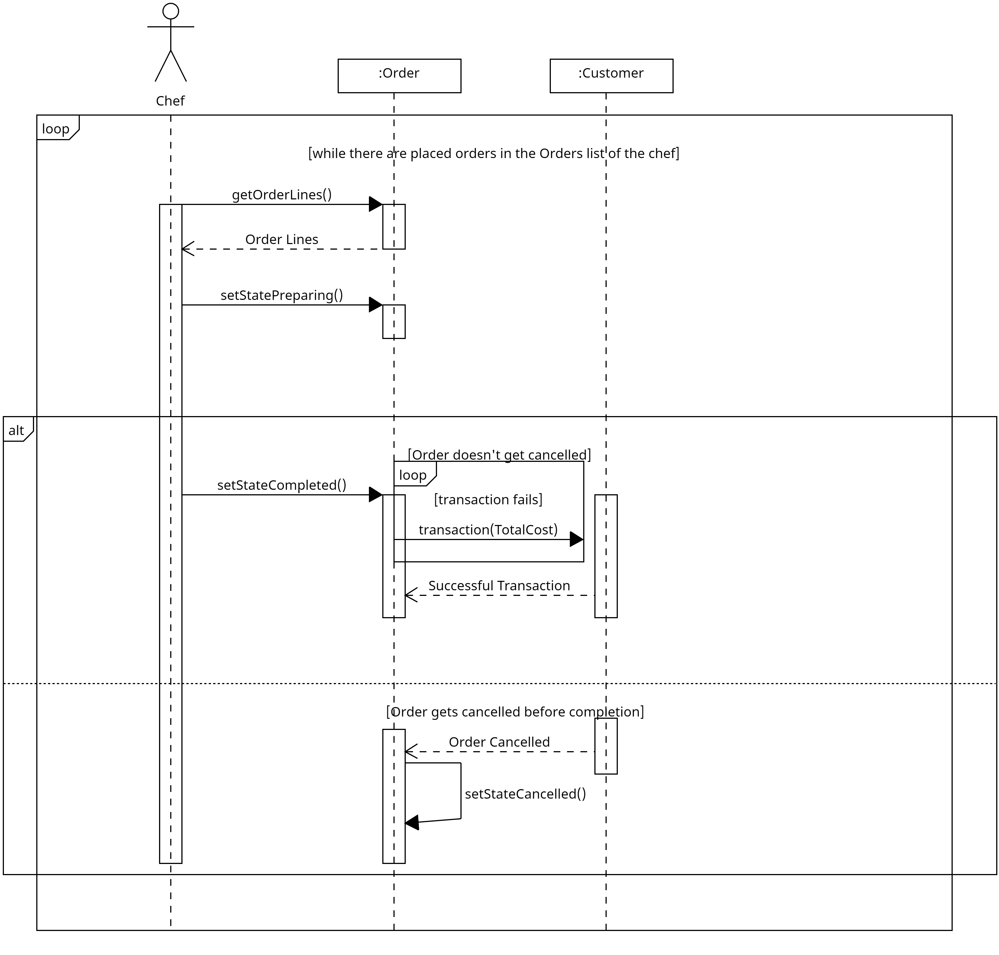

# **R3 Σχεδίαση και υλοποίηση της λογικής του πεδίου.**
## 3.1 **Διάγραμμα κλάσεων**
## [class diagram](docs/uml/Class%20Diagram/class%20diagram.uxf)

## **Sequence diagramms**
 ## [Chef signup sequence diagram](docs/uml/Sequence_diagrams.uxf/R3_chef_Signup_sequence_diagram.uxf)

## [Customer signup sequence diagram](docs/uml/Sequence_diagrams.uxf/R3_Customer_Signup_sequence_diagram.uxf)

## [Order cancellation sequence diagram](docs/uml/Sequence_diagrams.uxf/R3_order_cancellation_seq_diagram.uxf)

## [Order placing sequence diagram](docs/uml/Sequence_diagrams.uxf/R3_Order_placing_sequence_diagram.uxf)

## [order processing sequence diagram](docs/uml/Sequence_diagrams.uxf/R3_Order_Processing_sequence_diagram.uxf)

## [owner signup sequence diagram](docs/uml/Sequence_diagrams.uxf/R3_owner_signup_sequence_diagram.uxf)

## 3.2 **Υλοποίηση λογικής πεδίου σε java**

## [link to java package](app/src/main/java/gr/aueb/softeng/team08/)

## 3.3 **Αυτόματοι έλεγχοι σε Junit**
## [link to test package](app/src/test/java/gr/aueb/softeng/team08/)

## 3.4 **Αναφορές καλύψεων κώδικα**

## [link to coverage reports](docs/Junit%20Test%20Coverage%20Report/)