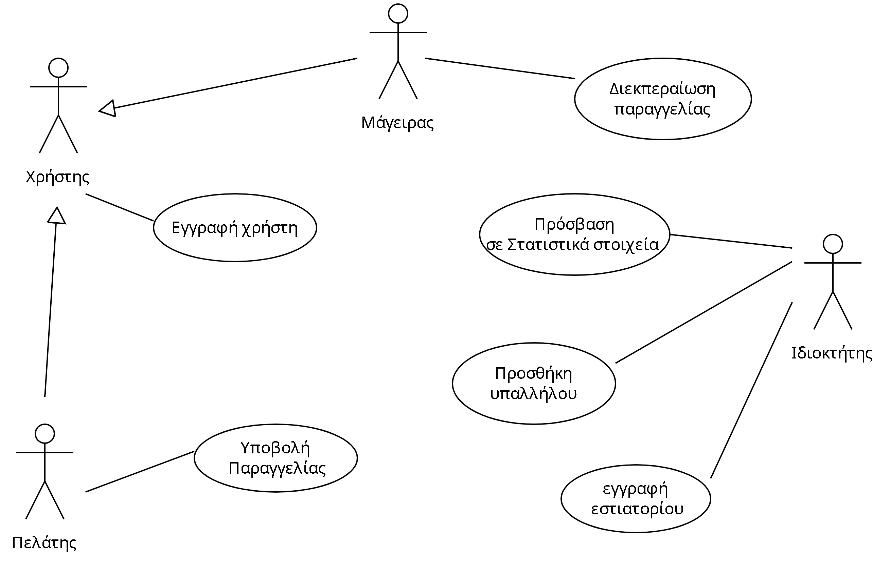

# Restaurant Application
Εργασία του μαθήματος Τεχνολογία Λογισμικού
Κώδικας και ανάλυση της λειτουργίας του συστήματος διαχείρισης παραγγελιών εστιατορίου

##  **Εισαγωγή**

Ένα σύστημα λήψης παραγγελιών για εστιατόριο που θα προσφέρει στους
σερβιτόρους επιλογή τραπεζιού, καταχώρηση παραγγελίας με επιλογή προϊόντων, υπολογισμός
συνολικού κόστους λογαριασμού, αλλαγή κατάσταση παραγγελίας. Ενώ για την
διοίκηση το σύστημα θα προσφέρει διάφορα στατιστικά για της πωλήσεις και υπολογισμούς
κέρδους, κόστους λειτουργίας κλπ.
    

# Περιγραφή Συστήματος Εστιατορίου

 

> **Το σύστημα προς σχεδίαση αφορά μία εφαρμογή ψηφιακού μετασχηματισμού ενός εστιατορίου.
> Οι actors αυτού του συστήματος είναι:**
- **ο ιδιοκτήτης** (owner) του εστιατορίου
-  **οι μάγειρες** (chefs) και
-   **οι πελάτες** (customers)
  
  Αρχικά, ο ιδιοκτήτης κάνει εγγραφή στο σύστημα για το εστιατόριό του και καταχωρεί τα στοιχεία του εστιατορίου, το μενού καθώς και τα διαθέσιμα τραπέζια.
  Η εφαρμογή θα εμφανίζει ένα κατάλληλο QR code για κάθε τραπέζι, το οποίο θα μπορεί να εκτυπωθεί και να τοποθετηθεί στα αντίστοιχα τραπέζια από τον ιδιοκτήτη του εστιατορίου.
  Επιπλέον, οι μάγειρες και οι πελάτες θα πρέπει να εγγραφούν με τα στοιχεία τους στο σύστημα δημιουργώντας λογαριασμό.
Οι πελάτες έχουν λογαριασμό με ηλεκτρονικό πορτοφόλι και οι μάγειρες έχουν λογαριασμό με ειδικά δικαιώματα αφού αυτοί προστεθούν από τον ιδιοκτήτη ως υπάλληλοι.
  Η εφαρμογή θα επιτρέπει στους πελάτες να διαχειρίζονται τις παραγγελίες τους μέσω μιας σελίδας με ενεργές παραγγελίες (σελίδα παραγγελιών) και μίας σελίδας με ολοκληρωμένες παραγγελίες (Ιστορικό παραγγελιών).
Μπορούν δηλαδή να πλοηγηθούν στο μενού του καταστήματος με τις επιλογές πιάτων και τις αντίστοιχες τιμές τους αφού σκανάρουν το QR code που θα είναι διαθέσιμο σε έντυπη μορφή στο τραπέζι με το κινητό τους τηλέφωνο. Έτσι θα μπορούν να υποβάλλουν την παραγγελία από το κινητό τους δηλώνοντας την ποσότητα του κάθε πιάτου που θέλουν από το μενού.
  Κάθε παραγγελία που υποβάλλεται από πελάτη θα εμφανίζεται στην οθόνη του κινητού / tablet του μάγειρα και ο ίδιος θα επισημαίνει την έναρξη και την ολοκλήρωση της προετοιμασίας της μέσω της εφαρμογής.
  Ακόμη, ο πελάτης μπορεί να δει τις παραγγελίες του και να παρακολουθεί την πορεία τους μέσω της εφαρμογής αλλά και να τις ακυρώσει σε περίπτωση που το επιθυμεί εφόσον αυτές δεν έχουν ολοκληρωθεί.
  Τέλος, αφού ο μάγειρας σημάνει την ολοκλήρωση της παραγγελίας τα χρήματα που της αναλογούν θα αφαιρούνται αυτόματα απο το ηλεκτρονικό πορτοφόλι του πελάτη, ο οποίος θα ενημερώνεται για την ολοκλήρωση της συναλλαγής με ειδοποίηση (θεωρούμε πως κατά την υποβολή της παραγγελίας ο πελάτης δεσμέυεται οτι θα πληρώσει και έφοσον δεν υπάρξει ακύρωση η συναλλαγή ολοκληρώνεται αυτόματα). Έπειτα ο σερβιτόρος την παραδίδει.
  Όλες οι παραγγελίες αποθηκεύονται σε αρχείο ετσι ώστε να μπορεί αργοτερα η εφαρμογή να παράγει αναφορές και στατιστικά στοιχεία τις οποίες μπορεί να προσπελάσει ο ιδιοκτήτης. Συγκεκριμένα, θα υπολογίζει τα μηνιαία και τα ετήσια έσοδα, τον μέσο όρο εξόδων που κάνει κάθε πελάτης, τον μέσο όρο ημερησίων εσόδων και το ποσοστό ακυρωμένων παραγγελιών.

# Απαιτήσεις Συστήματος

> ### Το σύστημα που θα υλοποιήσουμε έχει διάφορες απαιτήσεις οι οποίες θα πρέπει να ληφθούν υπόψη. Ανάμεσα σε αυτές είναι η ύπαρξη μίας διαδικασίας εγγραφής για τον ιδιοκτήτη του εστιατορίου, η δυνατότητα για κάθε ιδιοκτήτη να μπορεί να εισάγει τα στοιχεία του εστιατορίου, το μενού και τα τραπέζια και η παραγωγή διαφορετικών QR codes για κάθε τραπέζι. Επίσης, κρίνεται αναγκαία η εγγραφή για μάγειρες και πελάτες. Επιπλέον, είναι σημαντικό να μπορούν οι πελάτες να βλέπουν το μενού μέσω του QR code που σκανάρουν, να έχουν την δυνατότητα να επιλέξουν την επιθυμητή ποσότητα και το πιάτο που θέλουν. Ακόμη, θα πρέπει να μπορούν να δηλώσουν την παραγγελία τους μέσω της εφαρμογής εφόσον έχουν το απαραίτητο χρηματικό υπόλοιπο στο ηλεκτρονικό τους πορτοφόλι, να παρακολουθήσουν τις πληροφορίες και την πορεία της ή και να την ακυρώσουν. Οι μάγειρες πρέπει να μπορούν να βλέπουν τις παραγγελίες των χρηστών και να είναι σε θέση να ενημερώνουν την κατάσταση της κάθε παραγγελίας. Τέλος, το σύστημα θα πρέπει να παρέχει την δυνατότητα αποθήκευσης όλων των παραγγελιών και των στοιχείων τους (κόστος, ώρα, λογαριασμός, τραπέζι) ανά παραγγελία ώστε να μπορούν να παραχθούν τα απαραίτητα στατιστικά στοιχεία και να έχουν πρόσβαση σε αυτά οι ιδιοκτήτες των εστιατορίων.

 

## [ ***Use case diagram for restaurant***](docs/uml/requirements/use_case.png)

## [***.uxf file***](docs/markdown/uml/requirements/restaurant_use_case.uxf)

 

